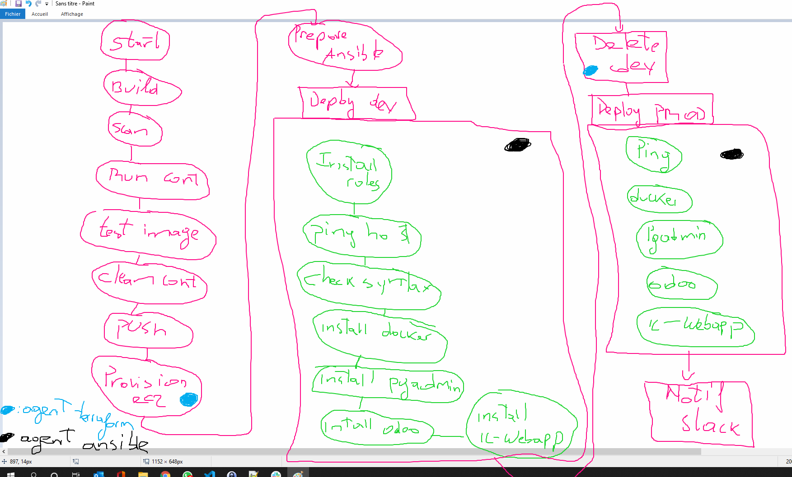

# Etapes à suivre
Ce petit tuto explique progressivement  comment mettre en oeuvre le prpojet fil rouge

## Prérequis

- Avoir **Virtualbox** et **Vagrant** sur son poste de travail afin de provisionner le lab en local

## Partie I : Build, test (**docker**) et déploiement l'application (**kubernetes**)

### Build, test et push de l'image Docker
#### Variables utilisées dans la documentation : *à adapter à votre cas*
- APP_EXPOSED_PORT : **8000**
- IMAGE_NAME : **ic-webapp**
- IMAGE_TAG : **v1.0**
- DOCKERHUB_ID : **choco1992**
- DOCKERFILE_NAME : **Dockerfile_v1.0**

#### Creation d'un répertoire de travail
Sur votre poste de travail, créer un répertoire de travail et déplacer vous dans ce répertoire.
Donnez lui le nom qui vous plait (**Projet fil rouge** par exemple)

#### Téléchargement du vagrantfile et ses dépendances dans le répertoire de travail
Les vagrantfiles Eazytraining se trouvent [ici](https://github.com/diranetafen/cursus-devops/tree/master/vagrant)

Prendre [celui ci](https://github.com/diranetafen/cursus-devops/tree/master/vagrant/minikube) de préférence

#### Ouvrir un terminal (Powershell) dans ce répertoire de travail et déployer Minikube dans virtualbox
- Shift + click droit sur le répertoire
- Ouvrir un terminal Powershell ici
- Lancer le déploiement avec **vagrant up --provision**
- Une fois le déploiement terminé, se connecter avec **vagrant ssh**
- Lancer Minikube avec **minikube start --driver=none**

#### Une fois minikube OK, télécharger les sources dans la VM minikube (cette VM contient déja docker installé)
>             git clone https://github.com/choco1992/ic-webapp.git
>             cd ic-webapp
#### Lancer le build de l'image et tester le fonctionnement du conteneur :
>             docker build --no-cache -f ./sources/app/${DOCKERFILE_NAME} -t $IMAGE_NAME:$IMAGE_TAG ./sources/app
>             docker run -d --name test-ic-webapp -p ${APP_EXPOSED_PORT}:8080 ${DOCKERHUB_ID}/$IMAGE_NAME:$IMAGE_TAG
#### RDV dans le navigateur de votre machine, taper http://**<votre_ip_machine>**:**${APP_EXPOSED_PORT}** pour finaliser le test
#### Supprimer le conteneur une fois le test validé et pousser l'image dans dockerhub
>             docker rm -f test-ic-webapp
>             docker tag $IMAGE_NAME:$IMAGE_TAG ${DOCKERHUB_ID}/$IMAGE_NAME:$IMAGE_TAG
>             docker login
>             docker push ${DOCKERHUB_ID}/$IMAGE_NAME:$IMAGE_TAG

### Automatisation via docker-compose **(Bonus)**
#### On créé les répertoires devant servir de volumes et on set les droits. Pour des besoins de faciliter, on va attribuer tous les droits sur ces foldes
>             sudo mkdir -p /data_docker/lib-odoo /data_docker/pgadmin4 /data_docker/postgres /data_docker/addons /data_docker/config
>             sudo chmod 777 -R  /data_docker/lib-odoo /data_docker/pgadmin4 /data_docker/postgres /data_docker/addons /data_docker/config 
#### Installation docker-compose
>             sudo curl -L "https://github.com/docker/compose/releases/download/1.29.2/docker-compose-$(uname -s)-$(uname -m)" -o /usr/local/bin/docker-compose
>             sudo chmod +x /usr/local/bin/docker-compose

#### **Infos**
le docker-compose contient les variables ODOO_URL et  PGADMIN_URL qui doivent etre renseignées avec l'ip machine de la VM vagrant.
ce sont les lignes suivantes : 
>            - "ODOO_URL=http://${HOST_IP}:8069/"
>            - "PGADMIN_URL=http://${HOST_IP}:5050/"
Du coup la variable d'en HOST_IP doit contenir cette IP machine. Sur notre infra, on va travailler avec l'interface **enp0s8**. Du coup la commande suivante permets de facilement récupérer cette IP machine : 
>             ip -4  a show enp0s8 | grep inet | awk '{print $2}' | awk -F'/' '{print $1}

#### lancement de la stack
>             cd docker-ressources
>             HOST_IP=$(ip -4  a show enp0s8 | grep inet | awk '{print $2}' | awk -F'/' '{print $1}')   docker-compose up -d
#### RDV dans le navigateur de votre machine, taper http://**<votre_ip_machine>**:**8080** pour finaliser le test

### Déploiement sur K8S
#### On créé les répertoires devant servir de volumes et on set les droits. Pour des besoins de faciliter, on va attribuer tous les droits sur ces foldes
>             sudo mkdir -p /data_k8s/lib-odoo /data_k8s/pgadmin4 /data_k8s/postgres /data_k8s/addons /data_k8s/config
>             sudo chmod 777 -R  /data_k8s/lib-odoo /data_k8s/pgadmin4 /data_k8s/postgres /data_k8s/addons /data_k8s/config
#### Aller dans le dossier manifestes-k8s et lancer les manifestes
>             cd ../manifestes-k8s
>             kubectl apply -f ic-webapp/
>             kubectl apply -f postgres/
>             kubectl apply -f odoo/
>             kubectl apply -f pg-admin/
#### RDV dans le navigateur de votre machine, taper http://**<votre_ip_machine>**:**30080** pour finaliser le test

## Partie II : CI avec Jenkins
Ici, le Jenkinsfile est celui du [tag v1.0](https://github.com/choco1992/ic-webapp/blob/v1.0/Jenkinsfile)

#### Lancer le Jenkins
#### Récupération du token pour L'IHM et creation de votre compte
Taper la commande suivante sur la VM Jenkins
>             docker exec -it jenkins_jenkins_1 cat /var/jenkins_home/secrets/initialAdminPassword

Une fois le token récupérer, se connecter a l'IHM Jenkins sur le port 8080 et insérer le token

#### Plugins Jenkins à Installer
- Docker
- Docker Pipeline
- docker-build-step
- Slack Notification

#### Caractéristiques du job Pipeline 
##### Secret et paramètres
|                   |Type              |Default Value    |Description                   |
|-------------------|------------------|-----------------|------------------------------|
|    snyk_token     | secret text      |      N/A        | token de connexion à snyk    |
| dockerhub_password| secret text      |      N/A        | Password dockerhub           |
|    IMAGE_TAG      | Paramètre du job |      v1.0       | tag de l'image docker        |
|  DOCKERFILE_NAME  | Paramètre du job | Dockerfile_v1.0 | Dockerfile à utiliser        |
|      HOST_IP      | Paramètre du job |   127.0.0.1     | adresse IP de la machine hote|
|  APP_EXPOSED_PORT | Paramètre du job |      8000       | Port expose de l'appli       |

##### Trigger  :  Scrutation de l'outil (**\* \* \* \* \***) ou webhook (A configurer dans Github)

Pipelne : 
    - Definition : Pipeline script from SCM > GIT
        - Branche : */main
        - Script Path : Jenkinsfile

## Partie III : CD avec Jenkins et Ansible
Voici un schema complet du Pipeline mis en place dans ce corrigé: 

### Test Mannuels des playbook ansible (Installer ansible sur le serveur de test)
Dans un premier temps, nous allons tester le déploiement via ansible manuellement, sans Jenkins.
Ca nous permettra de visualiser ce qui devra être embarqué dans le Jenkinsfile

Dans mon cas, j'ai utilisé la machine Jenkins, et Ansible était déja installé dessus, sinon, voici les commandes d'installation d'Ansible
>             yum -y install epel-release
>             yum install -y python3
>             curl -sS https://bootstrap.pypa.io/pip/3.6/get-pip.py | sudo python3
>             /usr/local/bin/pip3 install ansible
>             sudo yum install -y sshpass

Le déploiement sera fait sur les VMs virtualbox, avec les commandes suivantes depuis le serveur Jenkins : 

>             ansible-playbook install-docker.yml 
>             ansible-playbook deploy-odoo.yml -l odoo
>             ansible-playbook deploy-pgadmin.yml -l pg_admin
>             ansible-playbook deploy-ic-webapp.yml -l ic_webapp

Une fois terminé, il faut tester le fonctionnel sur le navigateur

#### Mise en place de la CD dans le Pipeline
Ici On a deux pipelines : 
1. Le tag [v2.0](https://github.com/ulrichmonji/ic-webapp/blob/v2.0/Jenkinsfile)
Il déploie uniquement sur des VMs virtualbox (la PROD). C'est le plus simple

2. Le tag [v3.0](https://github.com/ulrichmonji/ic-webapp/blob/v3.0/Jenkinsfile)
Il déploie sur un environnement de test (la DEV) provisionné sur une Machine AWS avant de déployer en PROD sur des VM virtualbox

#### Prérequis
- Il faut créer un bucket S3 en virginie du nord (nommé **terraform-backend-ulrich** pour moi)

#### Configuration du Jenkinsfile pour intégrer le déploiement Ansible

##### Secret et paramètres
En plus des paramètres et tokens utilisé à la partie CI, on aura aussi besoin des paramètres suivants : 

|                      |Type              |Default Value    |Description                   |
|----------------------|------------------|-----------------|------------------------------|
|     vault_key        | secret text      |      N/A        |  Mot de pass vault ansible   |
|    private_key       | secret file      |      N/A        |   Clés privé ssh du user     |
|    public_key        | secret file      |      N/A        |   Clés publique ssh du user  |
|  vagrant_password    | secret text      |      N/A        |    mdp du user vagrant       |
|       slack          | secret text      |      N/A        |   Token channel slack        |
|  aws_access_key_id   | secret text      |      N/A        |       access key aws         |
| aws_secret_access_key| secret text      |      N/A        |       secret key aws         |
|  private_aws_key     | secret file      |      N/A        |   Clés privé  ec2-user       |

##### Shared Library
Le pipeline utilise une librairie partagée nommée [ulrich-shared-library](https://github.com/ulrichmonji/sharedLibrary.git).

##### Slack
- Channel à utiliser  : **Channel** : #test_notif_jenkins
- Sous-domaine de l’équipe : **pozosworkspace**

##### Ports applicatif configuré
- ic-webapp : 8000
- odoo : 8069
- pgadmin : 5050

### Ameliorations
- Utilisation du plugin [Workspace Cleanup](https://plugins.jenkins.io/ws-cleanup/) pour nettoyer le workspac
- Automatisation de la mise en place d'une authen par clés publique/prive entre les serveurs de prod. [Exemple](https://linuxtechlab.com/how-to-use-ssh-command-with-password-in-single-line/)
- Mise des roles ansible sur un repos Git et install de ces roles via Ansible-Galaxy
- Création d'un fichier  ansible contenant les secret (mdp du user vagrant), fichier à vaulter biensûr

